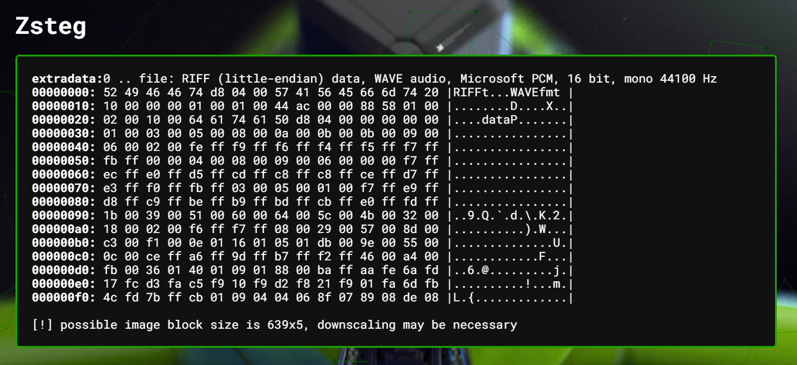
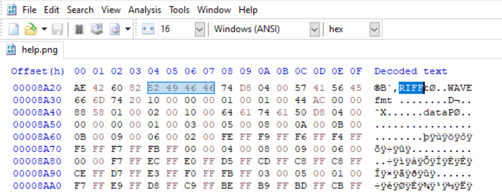
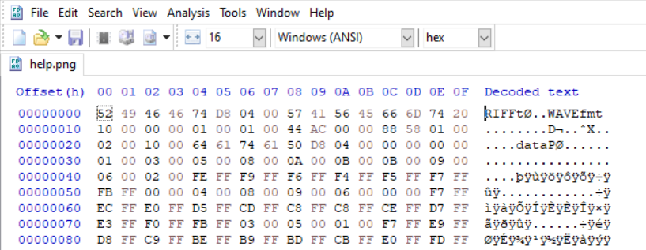
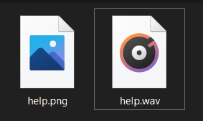
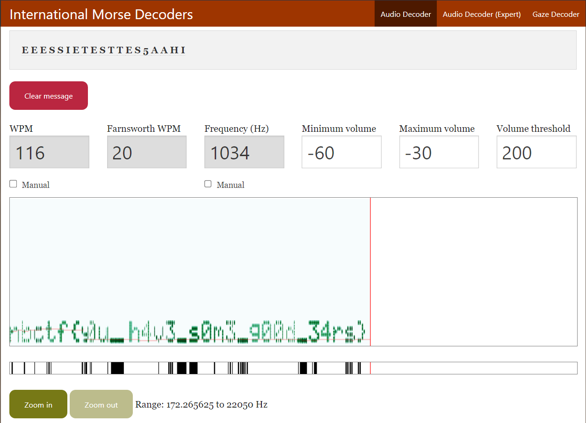

# do you hear that?
162 solves / 241 points
> I'm not sure why, but when I look at this image I can hear some sort of faint sound. Do you hear it too?

## About the Challenge
We were given an image called `help.png` (You can download the file [here](help.png)) and looking at the zsteg output of the image



It has a wav file inside the image.

## How to Solve?

We are going to trim and remove the image file via HxD, a hex editor app, and retain only the wav file.

- Before (Notice the offset)



- After



Then saving as a wav file.



After listening to the audio we identified the wave pattern as morse code and using the online tool Morse Code Adaptive Audio Decoder from `morsecode.world` we found th flag.



```
nbctf{y0u_h4v3_s0m3_g00d_34rs}
```

## Alternative Solution
Extract the WAV file inside the png using this command
```
zsteg -e extradata:0 help.png > help.wav
```

And then use spectogram analyzer, there's an online tool like [https://www.dcode.fr/spectral-analysis](https://www.dcode.fr/spectral-analysis) or you can use `Sonic Visualizer`.