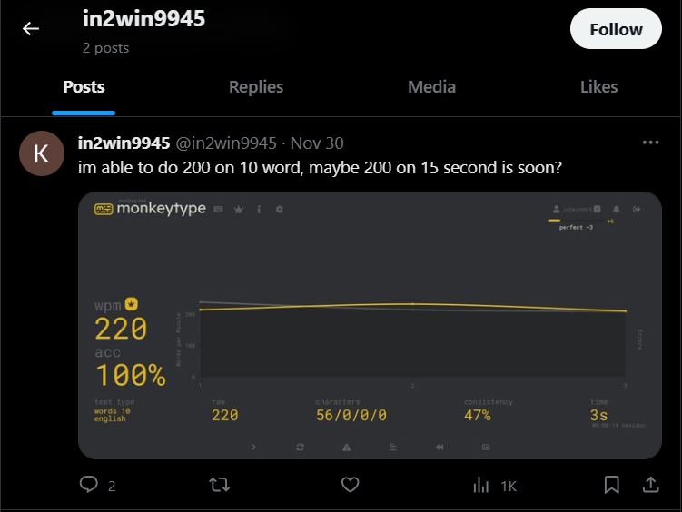
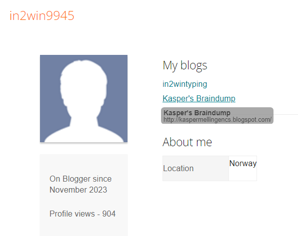
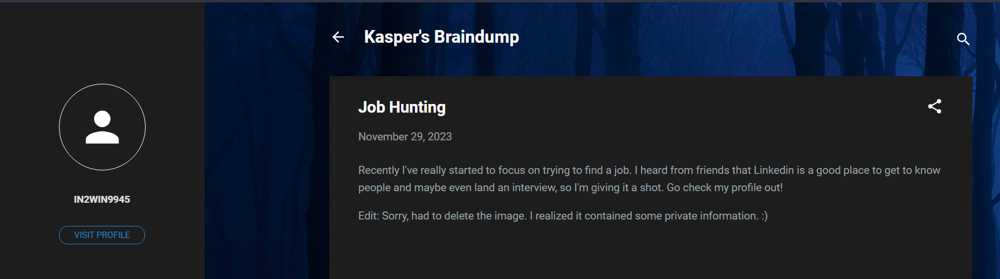

# persona
150 solves / 261 points
> I have this username, can you help me uncover who it really is? They go by the name in2win9945 online.

## About the Challenge
We are going to find the username `in2win9945` across the web and find the real name of the user then the flag.

Most of the go-to website is X (Twitter).

## How to Solve?
Visiting the account on X (Twitter), we can see that the user likes to type at `monkeytype`.



Going to monkeytype, it appears that the user has linked a blog website.


Investigating further, after looking for the blog's user profile another blog was linked.



Upon checking the recent post it was editted and a sensitive info was removed.



Using a web time machine `archive.org`, we can retrieve the saved snapshot of the post.


The deleted image in the post contains the user's real name in `LinkedIn` website.


Few minutes of finding the right LinkedIn profile and after checking post activity, we found the flag.


```
nbctf{o0p$_y0u_f0u$d_me}
```

## Alternative Solution
Utilizing the tool called `sherlock` for finding usernames in indexed websites.

```sh
sherlock in2win9945
```