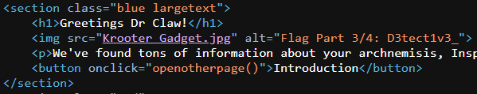

# Inspector Gadget
266 solves / 130 points
> While snooping around this website, inspector gadet lost parts of his flag. Can you help him find it?

## About the Challenge
We were given a website without any source code, and the flag has been split into 4 parts. We need to find all of them.

By viewing the source code of the website in the browser, we got this in the header section:
```html
<script>
    function openotherpage(){
        window.location.href = "Page1.html";
    }
    function opengadgetarms(){
        window.location.href = "gadgetarms.html";
    }
    function opengadgetcoat(){
        window.location.href = "gadgetcoat.html";
    }
    function opengadgethat(){
        window.location.href = "gadgethat.html";
    }
    function opengadgetskates(){
        window.location.href = "gadgetskates.html"
    }
    function opengadgetcopter(){
        window.location.href = "gadgetcopter.html"
    }
    function opengadgetmangifyingglass(){
        window.location.href="gadgetmag.html"
    }
    function opengadgetphone(){
        window.location.href="gadgetphone.html"
    }
    function getflag(){
        window.location.href="supersecrettopsecret.txt"
    }
</script>
```
Then we will view the source code in each file.

## How to Solve?
- Part 1/4:

We can find this in one of the hyperlink `/gadgetmag.html`.


- Part 2/4:

Checking the last file on script `/supersecrettopsecret.txt`.


- Part 3/4:

Found in image `alt` name in homepage



- Part 4/4:

Every website has the possibility of having `/robots.txt`.


Checking on the disallowed directory `/mysecretfiles.html`.


After having the last part, we have:

```
nbctf{G00d_J06_D3tect1v3_G4dg3t352}
```