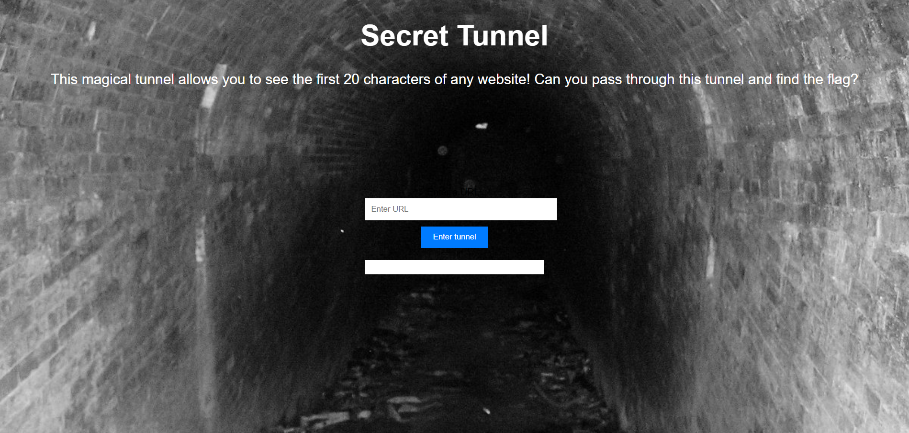
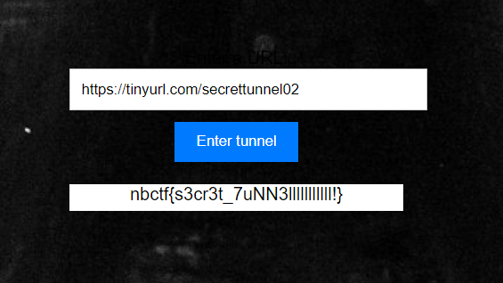

# secret tunnel
148 solves / 264 points
> Can you find the flag on the other end of my secret tunnel?

## About the Challenge
We were given a website and source code (You can download the source code [here](secret_tunnel.zip)). This is the preview of the website.



If we check the source code in **run.sh**, there are 2 ports `1337` and the HTTP port `80`. To get the flag we need to access port 1337 in `/flag` directory. But there are some restrictions:
- Checks if the string "127" is present in the URL.
- Checks if the count of dots in the URL is greater than 2.
- Checks if the character "x" is present in the URL.
- Checks if the string "flag" is present in the URL.

The source code:
```py
@app.route("/fetchdata", methods=["POST"])
def fetchdata():
    url = request.form["url"]

    if "127" in url:
        return Response("No loopback for you!", mimetype="text/plain")
    if url.count('.') > 2:
        return Response("Only 2 dots allowed!", mimetype="text/plain")
    if "x" in url:
        return Response("I don't like twitter >:(" , mimetype="text/plain") 
    if "flag" in url:
        return Response("It's not gonna be that easy :)", mimetype="text/plain")
...
```

## How to Solve?
I want to enter the URL `http://0.0.0.0:1337/flag` but it is restricted so I bypass it by using a URL shortener available online.


I entered it and here is the result:


```
nbctf{s3cr3t_7uNN3lllllllllll!}
```
## Alternative Solution
This is a server-side request forgery (SSRF) challenge.

We can bypass the restriction using `http://0:1337/fl%61g` payload:

- Instead of using localhost / 127.0.0.1 we can bypass it by using `http://0`
- To bypass the `flag` string restriction, we need to encode one / more character using url encoding