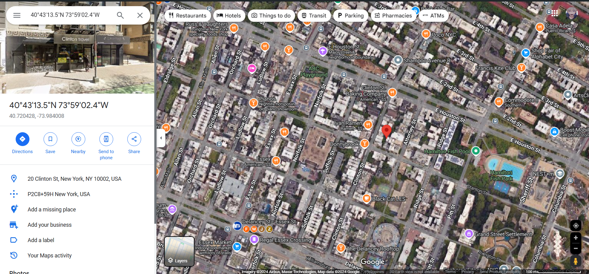
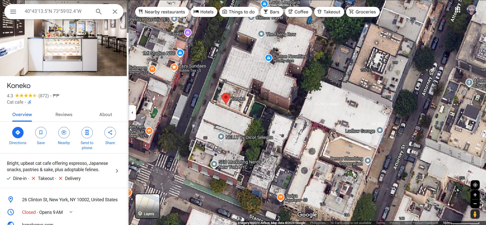

# One Friend
155 solves / 200 points
> "Check out this cool cat I found chilling at a local spot. The place had such a unique vibe, but I can't remember its name! Can you help me figure out the name of the establishment where the cat was photographed?

Submit your answer in the format: Flag = TMCTF{NameOfEstablishment}.

## About the Challenge
We are given an image file (You can download the image file [here](one_friend.zip)). This is the preview of the image.


## How to Solve?
I used exiftool to extract the metadata of the image file. The metadata contains the GPS coordinates of the location where the image was taken.

```bash
exiftool OneFriend.png
```
The GPS coordinates are:
```bash
GPS Position                    : 40 deg 43' 13.54" N, 73 deg 59' 2.43" W
```

[Google Map](http://maps.google.com/maps?f=q&q=loc:40.720428,-73.984008&t=k&spn=0.5,0.5) If you access it, you will find it to be a corner of New York. The name of the establishment is written on the board in the image.



Near [Cat Cafe](https://www.google.com/maps/place/Koneko/@40.7204578,-73.9841387,55m/data=!3m1!1e3!4m13!1m7!3m6!1s0x0:0x154f0a9766be64f2!2zNDDCsDQzJzEzLjUiTiA3M8KwNTknMDIuNCJX!3b1!8m2!3d40.720428!4d-73.984008!3m4!1s0x89c25981f43bf645:0xa07e80dfd33a154b!8m2!3d40.7204704!4d-73.9841702) discovered. The image and atmosphere are similar when you look at the photos in the store.



I went to the store name "Koneko".

```
TMCTF{Koneko}
```