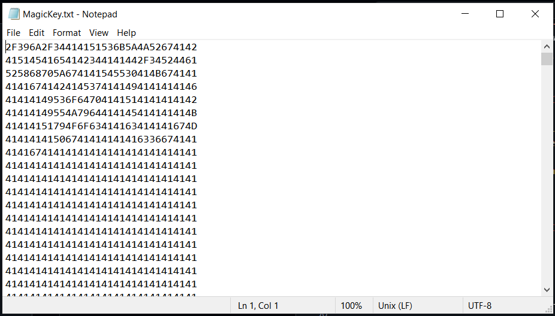
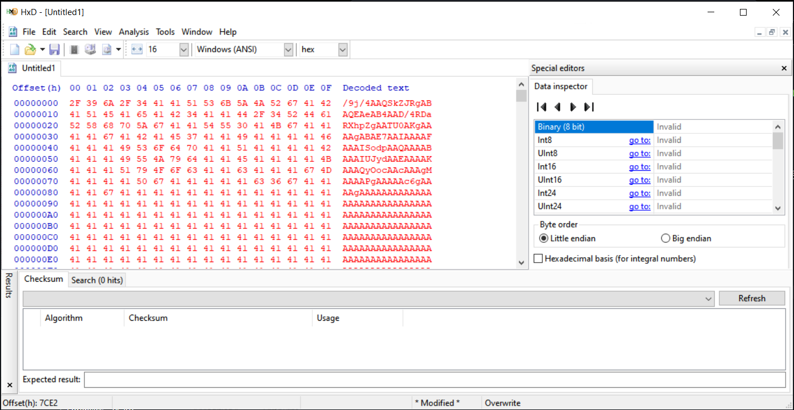
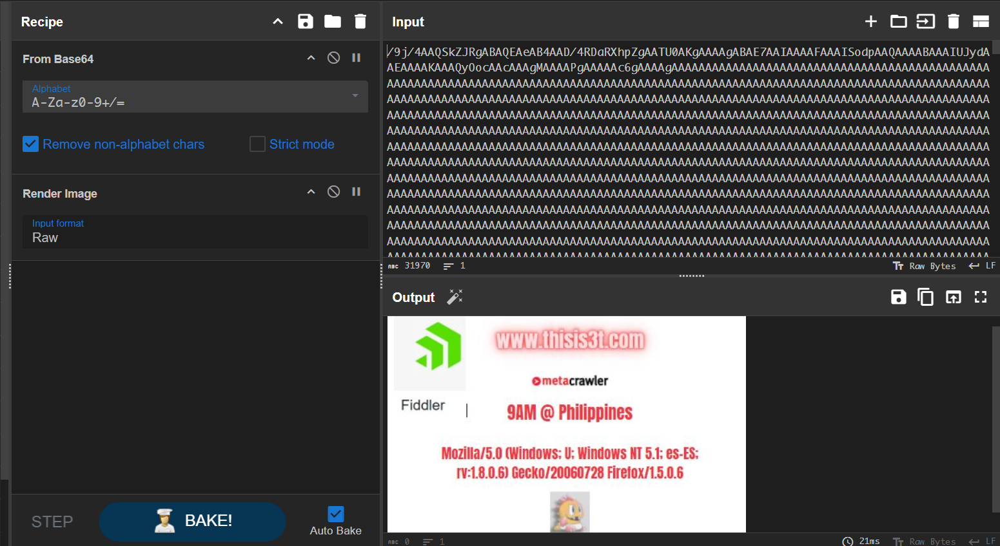

# Magic Key
101 solves / 200 points
> My friend handed me a text file and said, 'This is your key to a website.' I looked at it and thought, 'What? Now I’m stuck. Can you help me extract the website hidden in this file?

Flag= TMCTF{website}

## About the Challenge
We are given a text file with hex values (You can download the text file [here](magic_key.zip)). This is the preview of the text.



## How to Solve?
I identified it as a hex file and convert it to ASCII using a hex editor.



The ASCII text is a base64 encoded string. Decoding the base64 string and render it as images gives us the flag.



```
TMCTF{www.thisis3t.com}
```